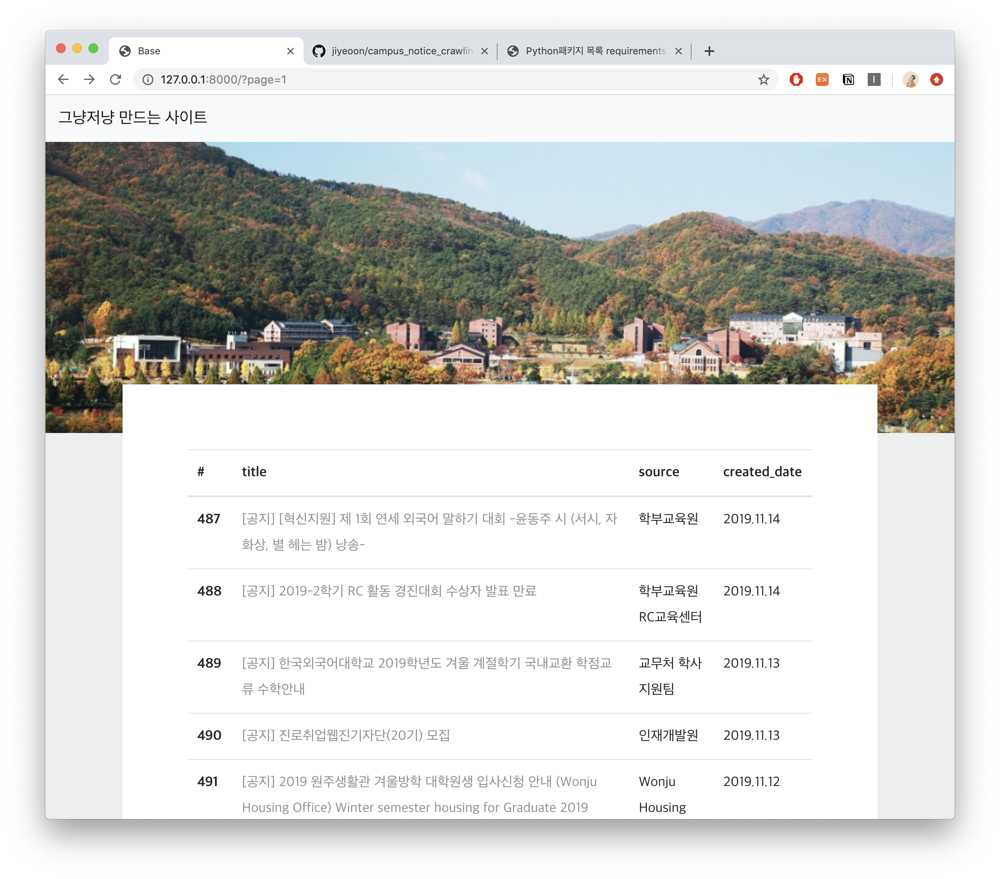
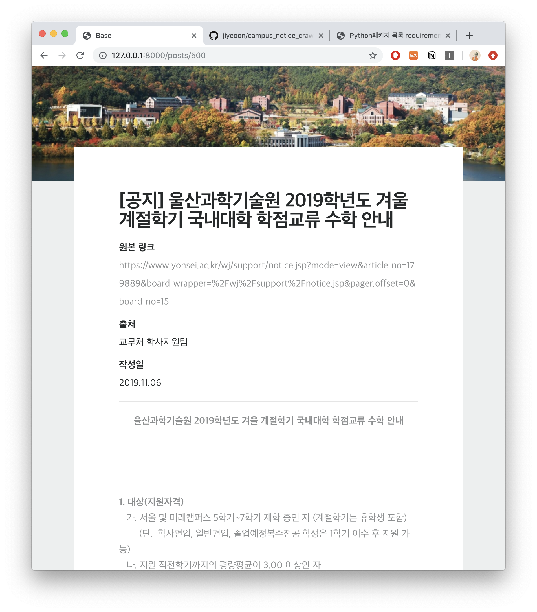

# Campus Notice Crawling Site

심심해서 만들어 본 학교 공지 크롤링하는 사이트~!


## Crawling File

|name | 내용 |
|:---:|:---|
`parser.py` | 크롤링하는 파일
`parsed_data` | 장고 파일들


## DownLoad python Packages
```text
$pip install -r requirements.txt
```


## Run Server
```text
$python manage.py runserver
```


## Sample Image





### Further Considering Points.. 
[] 파이썬 애니웨어는 http/https 리퀘스트가 안된다. -> 헤로쿠로 갈아타기?!
